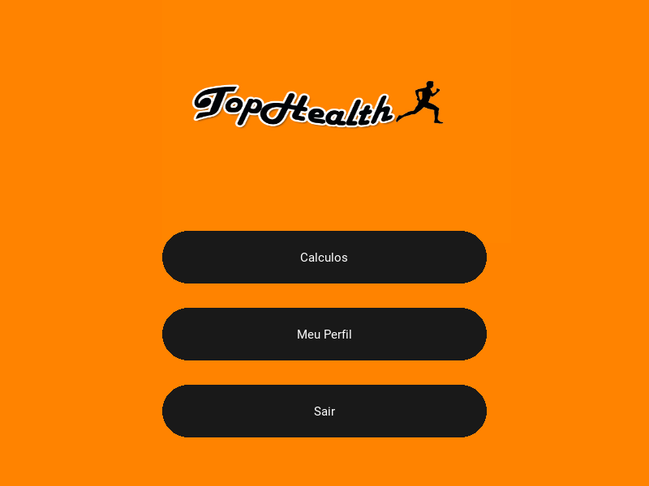

# TopHealth - Python_with_Kivy
Desenvolvimento de aplicaitvo utlizando a linguagem de progrmação Python através do framework Kivy, que possui tantas opções para desktop e mobile, e com ele possui alguns comandos próprios do Kivy, basicamente a parte lógica é feita em python e a gráfica em Kivy, neste projeto foi utilizado o SQL Lite para armazenamento de dados locais.
A dica é importar sempre as bibliotecas disponíveis para o Python.

Imagem do Aplicativo!

